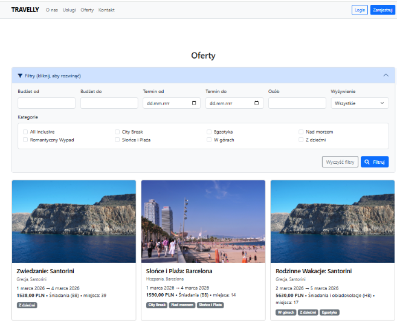
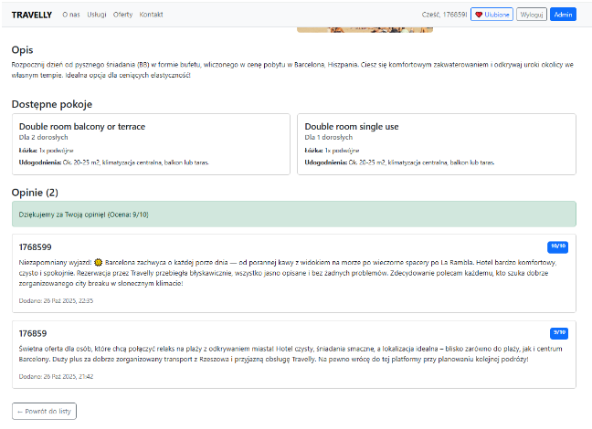
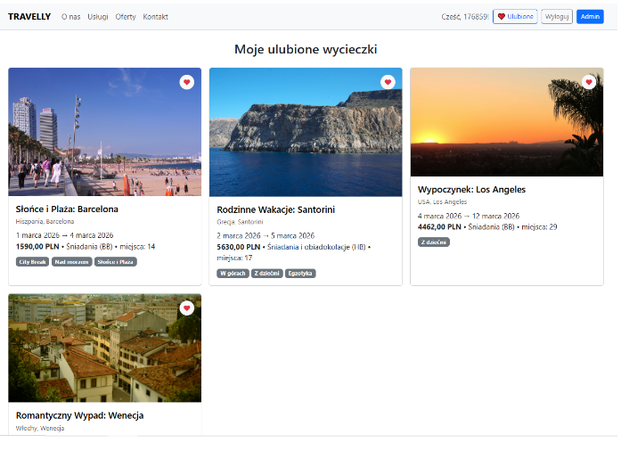
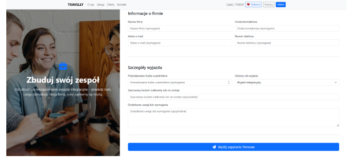
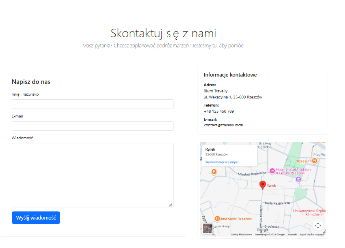
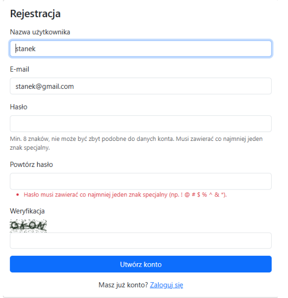
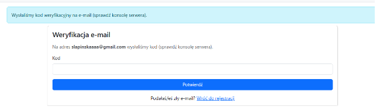
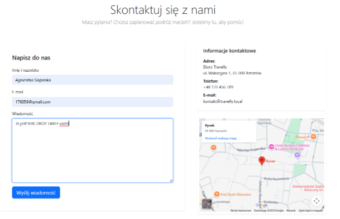
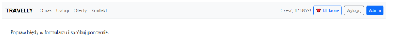
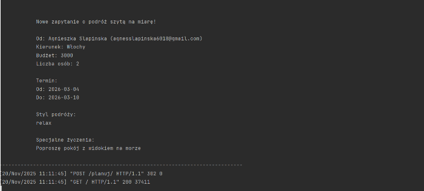

# Travelly - aplikacja webowa biura podróży z audytem bezpieczeństwa

## Opis projektu
**Travelly** to aplikacja internetowa dedykowana dla sektora turystycznego, automatyzująca proces wyszukiwania, prezentacji oraz interakcji klientów z ofertami biura podróży. System oferuje w pełni responsywny, nowoczesny interfejs użytkownika zintegrowany z bezpieczną warstwą backendową, systemem autoryzacji oraz modułami ocen w czasie rzeczywistym

Kluczowym elementem projektu było przeprowadzenie **pełnego audytu bezpieczeństwa i analizy ryzyka** zgodnie ze standardami OWASP, co zaowocowało wdrożeniem rygorystycznych mechanizmów obronnych przeciwko najpopularniejszym cyberzagrożeniom.

Projekt zrealizowany w ramach przedmiotów *Aplikacje Internetowe* oraz *Bezpieczeństwo i Ochrona Danych* na Politechnice Rzeszowskiej (Kierunek: Inżynieria i Analiza Danych)

## Technologie i narzędzia
* **Backend:** Python 3.14, Django Framework 5.2.7 (MVC / MVT Architecture)
* **Frontend:** HTML5, CSS3, JavaScript, Bootstrap 5.3.3 Framework
* **Baza danych:** Django ORM (zabezpieczona warstwa relacyjna oparta na SQLite)
* **Integracje zewnętrzne:** System chatbot (Tidio), biblioteka graficzna Pillow (PIL)
---

## Kluczowe funkcjonalności aplikacji

### 1. System dynamicznego filtrowania ofert
Zaawansowana wyszukiwarka wycieczek działająca w oparciu o kryteria budżetowe, daty, liczbę uczestników oraz wielokrotny wybór kategorii czy opcji wyżywienia.

<kbd>
  
</kbd>

### 2. Szczegóły oferty, pokoje oraz system opinii
Możliwość dodawania autoryzowanych opinii i ocen (w skali 1-10) przez użytkowników, połączona z podglądem parametrów logistycznych wycieczki i rodzajów dostępnych pokoi.

<kbd>
  
</kbd>

### 3. Moduł personalizacji ("Moje ulubione wycieczki")
Dedykowany widok dla zalogowanych użytkowników serwisu, pozwalający na przechowywanie oraz szybki dostęp do wybranych, polubionych wcześniej ofert.

<kbd>
  
</kbd>

### 4. Formularz dla klientów biznesowych ("Wyjazdy dla firm")
Profesjonalny, dwukolumnowy moduł zbierający zapytania ofertowe od grup zorganizowanych i przedsiębiorstw, uwzględniający nazwę firmy, cel wyjazdu i budżet.

<kbd>
  
</kbd>

### 5. Klasyczny formularz kontaktowy
Sekcja łącząca formularz szybkiej wiadomości z danymi teleadresowymi firmy oraz dynamicznie osadzoną mapą lokalizacyjną Google.

<kbd>
  
</kbd>

---

## Bezpieczeństwo i ochrona danych (Audyt SecOps)
Aplikacja została zaprojektowana zgodnie z paradygmatem *Security by Design*. Zaimplementowano zaawansowane mechanizmy ochrony przed krytycznymi wektorami ataków:

### 1. Wymuszanie złożoności haseł i bezpieczna rejestracja
Ochrona danych uwierzytelniających opiera się na algorytmie **PBKDF2** z funkcją skrótu SHA256 i unikalnym soleniem haseł. W pliku `settings.py` wdrożono zaawansowane walidatory (w tym autorski *Complexity Validator*) uniemożliwiające rejestrację konta ze zbyt słabym hasłem.

<kbd>
  
</kbd>

### 2. Dwuetapowa weryfikacja tożsamości (Double Opt-In)
Jako drugą linię obrony przed fałszywymi kontami wdrożono weryfikację skrzynek pocztowych. Nowo utworzone konto pozostaje nieaktywne do momentu wpisania losowo generowanego kodu wysłanego na podany adres e-mail.

<kbd>
  
</kbd>

### 3. Aktywna ochrona przed atakami SQL Injection
Dzięki warstwie abstrakcji **Django ORM** zapytania są w pełni parametryzowane, co uniemożliwia wstrzyknięcie kodu. Dodatkowo wdrożono czarną listę znaków niebezpiecznych (np. apostrofy, średniki) na poziomie walidacji formularzy wejściowych.

Próba wstrzyknięcia polecenia `DROP TABLE`:
<kbd>
  
</kbd>

Skuteczna blokada ataku przez system walidacji:
<kbd>
  
</kbd>

### 4. Logowanie i monitoring zdarzeń
Serwer aplikacji rejestruje każde zapytanie modyfikujące dane oraz błędy walidacji w czasie rzeczywistym, co pozwala na pełną rozliczalność i audyt zdarzeń w locie.

<kbd>
  
</kbd>

---

## Dokumentacja projektowa
W repozytorium (oprócz kodu źródłowego aplikacji) znajdują się szczegółowe sprawozdania techniczne:
* `SPRAWOZDANIE_PROJEKT_AI_SLAPINSKA_STANEK_SZCZUPAK.pdf` — Kompletna specyfikacja architektury aplikacji internetowej, opis frameworka Django, struktury Bootstrap oraz opis implementacji frontend/backend
* `bezpieczenstwo_i_ochrona_danych (1).pdf` — Pełen raport z testów penetracyjnych aplikacji, zawierający macierze analizy ryzyka (szacowanie ryzyka pierwotnego i szczątkowego) oraz dowody poprawności wdrożonych zabezpieczeń.

---

